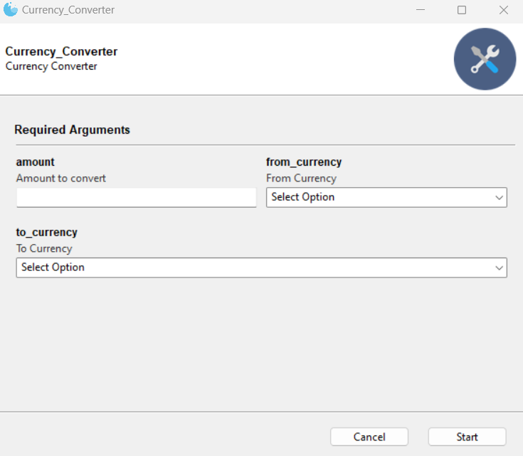

Certainly! Here's an enhanced description for your Currency Converter project that includes a placeholder for adding an image. Unfortunately, I can't directly embed or attach images, but I'll provide a placeholder where you can manually insert an image in Markdown format. Make sure to replace `` with the actual path or URL of your image.

```markdown
# Currency Converter

## Overview

The Currency Converter is a Python-based application that simplifies currency conversion using real-time exchange rates. This project utilizes the ExchangeRate-API to fetch up-to-date exchange rates and performs seamless currency conversions based on user input.

## Key Features

- **Real-time Exchange Rates:** Fetches the latest exchange rates from ExchangeRate-API.
- **Currency Conversion:** Allows users to convert currency from one form to another.
- **User-Friendly Interface:** Provides an intuitive command-line interface for a smooth user experience.

## Requirements

To use the Currency Converter, ensure that you have the following:

- Python 3.10
- `requests` library (`pip install requests`)
- ExchangeRate-API key (Sign up at [ExchangeRate-API](https://www.exchangerate-api.com/) to obtain a key)

## Installation

1. Clone the repository or download the source code.
2. Install the required dependencies using the following command:

   ```bash
   pip install requests
   ```

3. Replace `"YOUR_EXCHANGE_RATE_API_KEY"` in the code with your actual ExchangeRate-API key.

## Usage

1. Run the program by executing the following command:

   ```bash
   python currency_converter.py
   ```

2. Enter the required information as prompted:
   - Amount to convert
   - Source currency code (e.g., USD, EUR)
   - Target currency code (e.g., USD, EUR)

3. The program will fetch the latest exchange rates and display the converted amount.

## Screenshots




## Notes

- Make sure to sign up on ExchangeRate-API and replace the placeholder API key with your actual key.
- This program is a basic example and may not handle all edge cases.

## Acknowledgments

This Currency Converter is built using Python and the `requests` library to interact with ExchangeRate-API.

Feel free to customize and extend the functionality based on your requirements!
```

To include an image, replace `path/to/your/image.png` with the actual path or URL of your image.